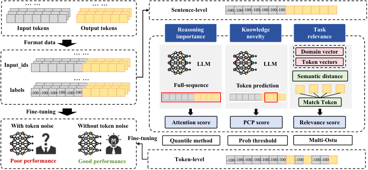

# Explainable Token-level Noise Filtering for LLM Fine-tuning Datasets

This repository contains the official implementation of **XTF (Explainable Token-level Noise Filtering for LLM Fine-tuning Datasets)**, a novel approach for token-level dataset augmentation for large language model fine-tuning, as presented at **ICLR 2026**.

## 📝 Abstract

 Large Language Models (LLMs) have seen remarkable advancements, achieving state-of-the-art results in diverse applications. Fine-tuning, an important step for adapting LLMs to specific downstream tasks, typically involves further training on corresponding datasets. However, a fundamental discrepancy exists between current fine-tuning datasets and token-level optimization mechanism of LLMs: most datasets are designed at the sentence-level, which introduces token-level noise, causing negative influence to final performance. In this paper, we propose XTF, an *explainable token-level noise filtering* framework. XTF decomposes the complex and subtle contributions of token-level data to the fine-tuning process into three distinct and explicit attributes (*reasoning importance*, *knowledge novelty*, and *task relevance*), which can be assessed using scoring methods, and then masks the gradients of selected noisy tokens accordingly to optimize the performance of fine-tuned LLMs.


## 🔍 Overview

XTF addresses limitations of traditional fine-tuning approaches by:

- **Three-Dimensional Attribute Analysis**: Decomposes token contributions into *reasoning importance*, *knowledge novelty*, and *task relevance*
- **Explainable Scoring**: Each attribute is assessed through interpretable scoring methods
- **Gradient Masking**: Masks gradients of identified noisy tokens while preserving important signal
- **Cross-domain Applicability**: Effective across mathematical, coding, medical, and financial domains

## 🏗️ Architecture

The XTF framework consists of three main components:

### 1. Dataset Editor (XTF_script.py)
The `DatasetEditor` class implements core token-level filtering:
- **Data Formatting**: Handles various dataset formats (GSM8K, HumanEval, CodeExercise-Python-27k, PubMedQA, FIQA, NuminaMath-CoT)
- **Three-Dimensional Attribute Scoring**:
  - **Reasoning Importance**: IQR-based (Interquartile Range) detection of attention outliers - tokens with unusual attention patterns are considered important for reasoning
  - **Knowledge Novelty**: Softmax probability with percentile-based thresholding - high perplexity tokens represent novel knowledge
  - **Task Relevance**: Cosine similarity between token embeddings and domain vocabulary vector - measures relevance to target domain
- **Adaptive Thresholding**:
  - **Task Relevance**: Multi-Otsu segmentation with cumulative proportion-based threshold selection
  - **Reasoning Importance**: IQR method with 1.5×IQR bounds and percentage-based fallback
  - **Knowledge Novelty**: Fixed probability threshold with percentile-based alternative
- **Token Filtering**: Labels tokens as -100 for ignored positions based on multi-dimensional criteria

### 2. Training Scripts
- **main.py**: Complete pipeline orchestrating data augmentation, training, and evaluation
- **XTF_script.py**: Token-level data augmentation with DatasetEditor class
- **LoRaFT_script.py**: LoRA-based parameter-efficient fine-tuning
- **SFT_script.py**: Standard full-parameter supervised fine-tuning

### 3. Evaluation Pipeline
- **Eval_script.py**: Model loading and evaluation orchestration
- **utils/dataset_eval.py**: Domain-specific evaluation functions:
  - GSM8K: Mathematical reasoning accuracy
  - HumanEval: Code generation pass@k metrics
  - PubMedQA: Medical QA with judge model
  - FIQA: Financial QA with BERTScore

## 📊 Supported Datasets

| Training Dataset | Evaluation Dataset | Evaluation Metric | 
|----------------|--------------------|------------------|
| **CodeExercise-Python-27k** |  HumanEval | Pass@k | 
| **GSM8K** |  GSM8K | Accuracy | 
| **PubMedQA** |  PubMedQA | Judge Model Accuracy | 
| **FIQA** | FIQA | Judge Model Accuracy | 
| **NuminaMath-CoT** | Math500 | Accuracy| 

## 🚀 Installation

### Requirements


```bash
pip install -r requirements.txt
```

### Download Models

The framework uses ModelScope for model and dataset access. Models will be automatically downloaded when first used.

## 💻 Usage

### Basic Usage with Main Script

The main script provides a complete pipeline from data augmentation to evaluation:

```bash
python main.py \
    --model_name deepseek-ai/DeepSeek-R1-Distill-Qwen-1.5B \
    --train_dataset_name modelscope/gsm8k \
    --score_weights 1.0 1.0 1.0 \
    --percentage_interest 0.05 0.05 0.05 \
    --gpu 0 \
    --use_lora 1 \
    --epochs 4 \
    --batch_size 8
```

### Step-by-Step Pipeline

#### 1. Data Augmentation with XTF

```bash
python XTF_script.py \
    --model_name deepseek-ai/DeepSeek-R1-Distill-Qwen-1.5B \
    --dataset_name modelscope/gsm8k \
    --score_weights 1.0 1.0 1.0 \
    --percentage_interest 0.05 0.1 0.05 \
    --output_data_file data/augmented_gsm8k.txt \
    --gpu 0
```

**Parameters:**
- `--score_weights`: Three values for [reasoning importance, knowledge novelty, task relevance] - set to non-zero to enable corresponding scoring mechanism
- `--percentage_interest`: Three values for [reasoning%, novelty%, relevance%] - percentile thresholds for token selection
- `--output_data_file`: Path to save augmented dataset

#### 2. Fine-tuning with LoRA

```bash
python LoRaFT_script.py \
    --data_path data/augmented_gsm8k.txt \
    --model_name deepseek-ai/DeepSeek-R1-Distill-Qwen-1.5B \
    --adapter_save_path lora_adapters \
    --batch_size 8 \
    --epochs 4 \
    --learning_rate 2e-4 \
    --lora_r 8 \
    --lora_alpha 32 \
    --lora_dropout 0.0 \
    --dataset_name modelscope/gsm8k \
    --gpu 0
```

#### 3. Evaluation

```bash
python Eval_script.py \
    --original_model_path deepseek-ai/DeepSeek-R1-Distill-Qwen-1.5B \
    --model1_path lora_adapters \
    --model2_path lora_adapters_xtf \
    --dataset_name modelscope/gsm8k \
    --batch_size 16 \
    --use_lora 1 \
    --k_values 1 \
    --gpu 0 \

    
```
## 🔧 Customization

### Change Domain Words
Modify domain vocabulary in XTF_script.py:


### Change Domain Words
Modify domain vocabulary in XTF_script.py:
```python
# Mathematical domain example
domain_words = ["1", "2", "3", "4", "5", "+", "-", "*", "/", "=", "maths"]

# Medical domain example
domain_words = ["gene", "protein", "cell", "study", "research", ...]
```

## 📄 Citation

```bibtex
@inproceedings{yangexplainable,
  title={Explainable Token-level Noise Filtering for LLM Fine-tuning Datasets},
  author={Yang, Yuchen and Lin, Wenze and Huang, Enhao and Chu, Zhixuan and Tao, Lan and Li, Yiming and Qin, Zhan and Ren, Kui and others},
  booktitle={The Fourteenth International Conference on Learning Representations}
}
```

## 📄 License

This project is licensed under the MIT License - see [LICENSE](LICENSE) file for details.

## 🔗 Links

- [Paper](https://arxiv.org/abs/2602.14536)


---

